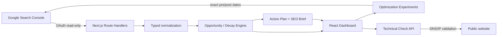

# SearchLift

**SearchLift turns Google Search Console data into a prioritized SEO work queue.**

Instead of stopping at clicks, impressions, CTR and average position, SearchLift tries to answer a more useful question:

> What should I work on next, why, and how will I know whether the change helped?

## What it does

- Google OAuth 2.0 with **read-only Search Console** access
- multi-property GSC switcher
- **Site Portfolio** view to compare several properties and surface the ones needing attention
- live 28/90-day current-vs-previous comparisons
- **Opportunity Finder** with transparent 0–100 scoring and confidence guardrails
- **Estimated Click Gain** based on a realistic next target-position CTR model
- **Content Decay** detection
- lost-query diagnosis for declining pages
- **Low CTR** opportunities
- **Quick Wins** close to stronger ranking zones
- rising-content detection
- **Cannibalization Detector** for queries shared by several landing pages
- **Action Plan** sorted by priority, impact and estimated upside
- **SEO Brief** with biggest wins/losses, queries entering/leaving TOP 10 and new queries
- Page Explorer and Query Explorer
- **Optimization Tracker**
- exact 7/14/28-day **before-vs-after GSC experiments** around the implementation date
- on-demand **technical page context** (HTTP, response time, title, description, H1, canonical, indexability, robots.txt, sitemap.xml)
- SSRF protection for server-side technical checks
- CSV export
- Demo Mode without Google credentials
- encrypted HTTP-only OAuth session cookie

## Why it is useful

Search Console is excellent raw data. The hard part is prioritization.

A useful SearchLift output looks like this:

```text
/page-a
Opportunity score: 86 / 100
Position: 8.2
Impressions: 14,800
CTR: 1.1%
Estimated click gain: +184 / period

Why?
- meaningful search demand
- ranking is close to a stronger click zone
- CTR is below the benchmark for the current position

Action
- inspect search intent
- improve title / snippet if CTR is weak
- strengthen sections and internal links
- track the change as an experiment
```

For a declining page, SearchLift also surfaces the queries contributing most to the loss.

## Stack

- Next.js 16
- React 19
- TypeScript
- Tailwind CSS
- Next.js Route Handlers / Node.js
- Google OAuth 2.0
- Google Search Console API

No database is required for the portfolio build. Optimization notes are kept in browser localStorage; exact experiment measurements are fetched live from GSC.

## Architecture



## Local setup

```bash
npm install
cp .env.example .env.local
npm run dev
```

Open `http://localhost:3000`.

Without `.env.local`, SearchLift automatically starts in Demo Mode.

## Google Search Console setup

Create a Google Cloud OAuth Web Application and enable **Google Search Console API**.

Authorized redirect URI:

```text
http://localhost:3000/api/auth/google/callback
```

Add the read-only scope:

```text
https://www.googleapis.com/auth/webmasters.readonly
```

Then fill `.env.local`:

```env
GOOGLE_CLIENT_ID=...
GOOGLE_CLIENT_SECRET=...
GOOGLE_REDIRECT_URI=http://localhost:3000/api/auth/google/callback
SESSION_SECRET=...
```

Generate a session secret with:

```bash
node -e "console.log(require('crypto').randomBytes(32).toString('hex'))"
```

Never commit `.env.local` or OAuth credentials.

## Quality checks

```bash
npm run typecheck
npm run lint
npm run build
```

## Important product decisions

- Opportunity Score is a **SearchLift heuristic**, not a Google metric.
- Estimated Click Gain is an estimate based on impressions, current ranking and a target-position CTR benchmark. It is not a traffic promise.
- Low sample sizes cap opportunity confidence and score.
- Cannibalization is a review signal, not automatic proof that URLs should be merged.
- Search Console can omit low-volume rows and does not guarantee a complete raw export.
- Final Search Console data can lag; comparisons use a buffer and optimization experiments report how many post-change days are actually available.

## Security decisions

- Google Client Secret never reaches the browser.
- OAuth access/refresh data is stored in an encrypted HTTP-only cookie.
- OAuth scope is read-only.
- Technical audits reject localhost, private IP ranges and hostnames resolving to private addresses.
- Redirect destinations are revalidated server-side.
- Technical fetches use timeouts and a maximum HTML response size.

## Portfolio / interview talking points

This project demonstrates:

1. React UI and state management
2. TypeScript domain models
3. Next.js server routes
4. OAuth 2.0 and token refresh
5. external API integration
6. pagination of GSC rows
7. business-rule / scoring design
8. low-data guardrails
9. date-window analytics
10. security considerations around server-side URL fetching
11. translating raw analytics into an actionable product

See:

- `docs/ARCHITECTURE.md`
- `docs/INTERVIEW_GUIDE.md`
- `PROJECT_WALKTHROUGH.md`
- `GITHUB_PUBLISH.md`
